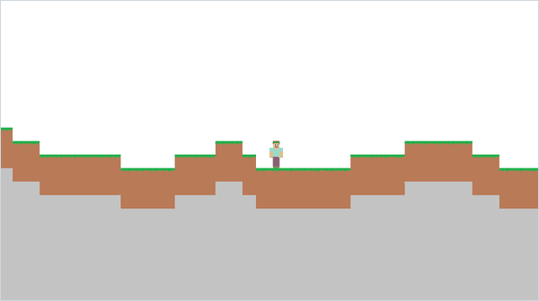

<div align="center">

# Minecraft 2D

*A side-view block sandbox inspired by Minecraft, with random-walk terrain, digging, building and TNT.*




</div>

## About

A Minecraft-inspired 2D sandbox written from scratch in one Pygame file, `mimecraft2D.py` (the misspelling is the original file name). It generates a random world 201 columns wide and 100 blocks deep, lets the player walk, sprint and jump under gravity, and breaks or places blocks wherever you click. TNT clears a 5 × 5 area when detonated. All the textures are small hand-drawn pixel-art PNGs. `experiments/isometric-blocks` holds an earlier attempt at a block world drawn in an oblique 3D view.

## Quick start

```bash
python -m pip install -r requirements.txt
python mimecraft2D.py
```

Run it from the repository folder so the textures load, and stop it with <kbd>Ctrl</kbd>+<kbd>C</kbd> in the terminal, because closing the window does nothing.

## Controls

| Input | Action |
| --- | --- |
| <kbd>A</kbd> / <kbd>D</kbd> | Walk left / right |
| Hold <kbd>Left Ctrl</kbd> | Sprint |
| <kbd>Space</kbd> | Jump, only while standing on a block |
| Left click | Remove the block under the cursor |
| Right click | Place stone in an empty cell, or detonate a TNT block |
| Middle click | Place TNT in an empty cell |

## How it works

- **Terrain.** `crearmundo` (create world) builds 201 column heights as a random walk. The first height is 60 to 70 blocks. If the current flat run is $k$ columns long (`llano_segido`), the next column keeps the same height or steps by one with

  ```math
  P(\text{same}) = 1 - \frac{1}{8-k}, \qquad P(+1) = P(-1) = \frac{1}{2(8-k)}
  ```

  so a flat stretch becomes less likely to continue the longer it gets, and never lasts more than seven columns.
- **Columns of blocks.** `escribir_mundo` (write the world) turns a height $h$ into a column of 100 cells: $100 - h$ of air, a grass-topped block (`tierra.png`, earth), two dirt blocks (`suelo.png`, ground) and $h - 3$ of stone (`piedra.png`). The world `mundo` is a list of columns holding the texture surfaces themselves, with 0 for air, so a block's type is its image.
- **Camera.** Every frame, cell $(x, y)$ is drawn at screen position $(20x - x_j + 970, 20y - y_j + 600)$, where $(x_j, y_j)$ is the player's position in world pixels (`xjugador`, `yjugador`). The view follows the player both ways while the sprite stays fixed near the centre.
- **Movement and gravity.** Walking moves the player 2 px per frame, or 4 while sprinting, if a single cell at knee height on that side is air. A jump sets the vertical speed to $v_0 = 3$ px per frame. While there is no block under the feet, or the player is still rising, each frame applies gravity $g = 0.1$:

  ```math
  v \leftarrow v - g, \qquad y_j \leftarrow y_j - v, \qquad h_{\max} \approx \frac{v_0^2}{2g} = 45\ \text{px}
  ```

  so a jump clears a little over two blocks.
- **Editing.** A click is mapped back to a world cell by inverting the camera transform and dividing by the 20 px block size. Placing only works in air. Right-clicking a TNT block sets the 5 × 5 square around it to air; other TNT caught in the blast is removed, not detonated.

## Code map

| Path | Role |
| --- | --- |
| `mimecraft2D.py` | The sandbox: terrain generation, drawing, movement and block editing |
| `*.png` | 16 × 16 block textures (`tierra` grass, `suelo` dirt, `piedra` stone, `tnt`, `tronco` log), the 16 × 32 player `steve.png` and the 182 × 22 hotbar `inventariop.png` |
| `experiments/isometric-blocks/` | Earlier prototype: `cubo.py` draws a 25 × 25 × 25 block grid in an oblique projection with its own 12 × 12 textures and removes blocks on click. Run it from that folder |

## Limitations

- The player always spawns at column 100, row 60, wherever the terrain is. In 20,000 simulated worlds the surface at that column was always higher, by a median of 25 blocks, so a normal start is buried in rock and you have to dig out with the mouse. The preview uses a hand-picked seed.
- Closing the window does nothing, because `pygame.QUIT` is not handled. The window is a fixed 1940 × 1080, wider than a 1080p screen, and the loop has no frame cap and blits every block of the world each frame, so the speed depends on the machine.
- The world has hard edges. Walking or clicking past the right end, clicking or falling below the bottom row, or detonating TNT near the right or bottom edge raises `IndexError`, while negative indices silently wrap to the other end of the world.
- Collision only checks one cell at knee height when walking and the cell under the feet when falling. There is no ceiling check, so a jump passes through blocks overhead.
- The hotbar is drawn, but the nine-slot inventory list is never used. `tronco.png` (log) is loaded, but a typo scales the dirt texture into it, and logs are never placed. There is no saving.
- In `experiments/isometric-blocks`, the world is built by list multiplication, so rows share one list: the intended 3 × 3 × 3 dirt cube is drawn as a bar running off the right edge, and a click removes a whole row of it. The click test also swaps x and y relative to the drawing, so the removed row is not the one under the cursor. A click near the top edge of the window raises `IndexError`, because the visibility check reads one cell past the grid.

## Background

Written around 2023, on or before June 2023. Both programs come from a code backup made that month; the isometric prototype is the earlier attempt at the same idea.

---

<div align="center"><sub>Part of <a href="https://github.com/lnivan">lnivan's projects</a> · <b>Games</b></sub></div>
